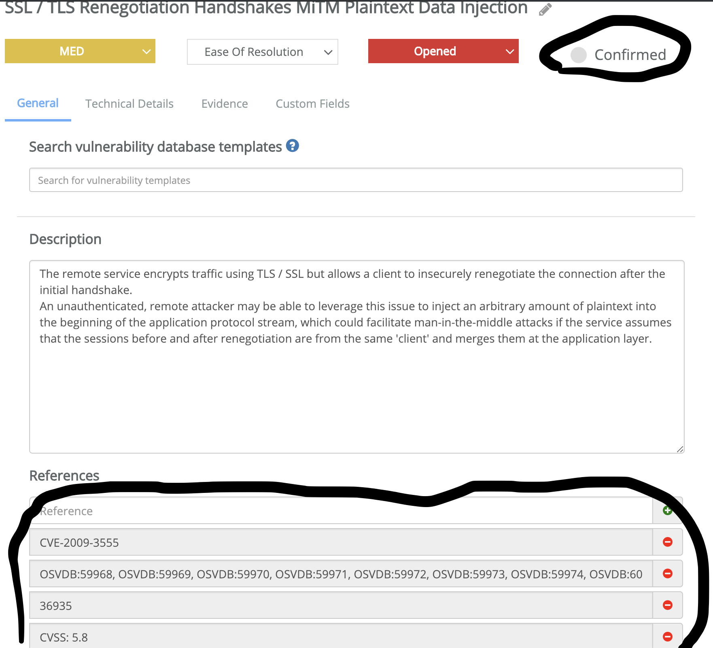
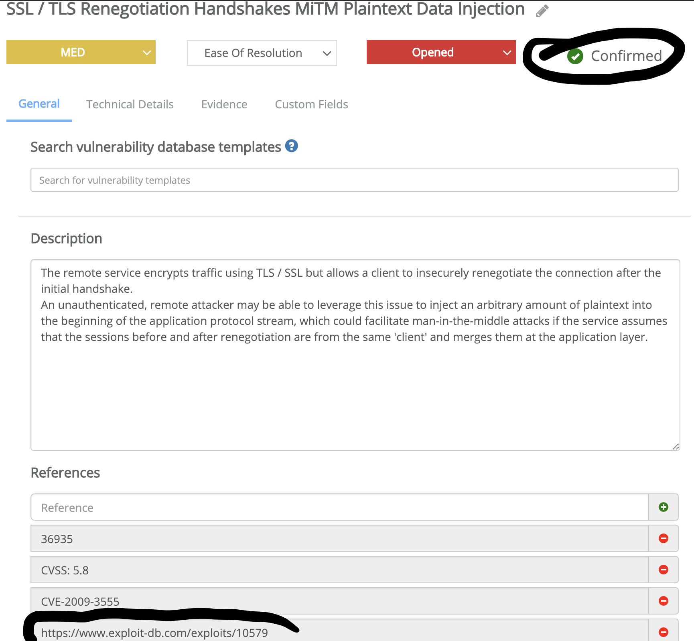

# kakunin

## この脆弱性は確認した！

An script to **Confirm** and add **References** of [Faraday](https://github.com/infobyte/faraday) Vulnerabilities when public exploits are available

Looking CVE's on each vulnerability and lookup for ExploitDB using [vFeed DB](https://github.com/toolswatch/vFeed)


## Usage

First, get [vFeed DB](https://github.com/toolswatch/vFeed) (sqlite) 

```
~/kakunin$ ./kakunin.py
  _         _                _
 | | ____ _| | ___   _ _ __ (_)_ __
 | |/ / _` | |/ / | | | '_ \| | '_ \
 |   < (_| |   <| |_| | | | | | | | |
 |_|\_\__,_|_|\_\\__,_|_| |_|_|_| |_|


Author: Emilio / @ekio_jp
Version: 1.0

usage: kakunin.py [-h] [-d] -w <workspace> [-s <server>] -i <vfeed.db>
                  [-u <username>] [-p <password>]

optional arguments:
  -h, --help      show this help message and exit
  -d              Dry-run TEST
  -w <workspace>  Faraday Workspace
  -s <server>     Faraday Server (default: http://localhost:5985)
  -i <vfeed.db>   vfeed.db by https://github.com/toolswatch/vFeed
  -u <username>   Faraday Username (default: faraday)
  -p <password>   Faraday Password (default: prompt)
~/kakunin$
```

Run `kakunin.py` for Faraday workspace called `test1`

```
~/kakunin$ ./kakunin.py -w test1 -i vfeed.db
Password:
Amount of Vulnerabilities in Workspace:  368
Confirm Vuls and Reference Updated:  17
~/kakunin$
```

## Status Report **before** `kakunin.py`



## Status Report **after** `kakunin.py`




# ToDo

- [ ] Make the code nicer

----

# Author

Emilio / [@ekio_jp](https://twitter.com/ekio_jp)

----

# Licence

Please see [LICENSE](https://github.com/ekiojp/kakunin/blob/master/LICENSE).
